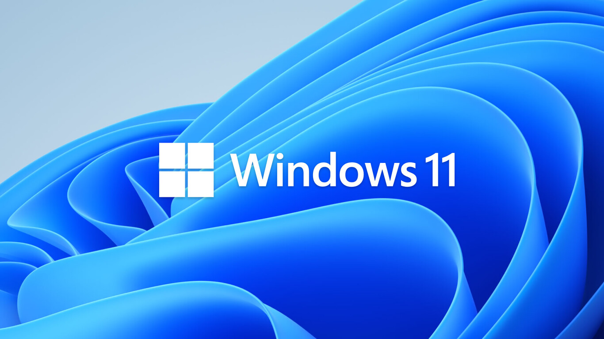
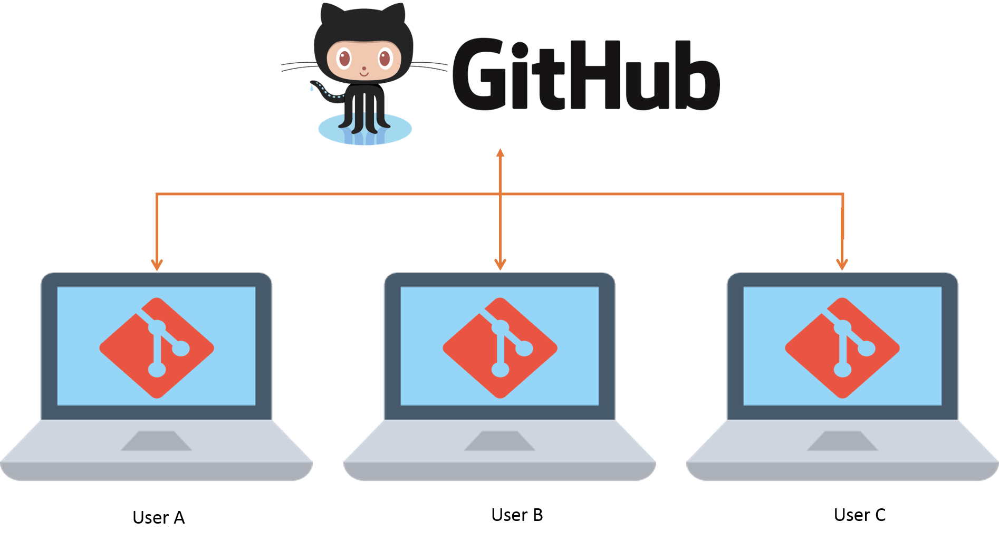
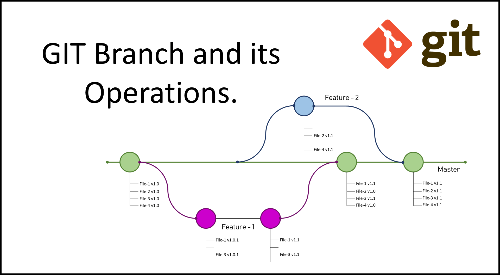

//Pretendemos crear unos apuntes, a modo de chuleta con lo esencial de clase.

1.1. ¿Qué es Git y GitHub?**


Git es un **sistema de control de versiones distribuido** que permite a los desarrolladores gestionar y realizar un seguimiento de los cambios en los archivos de código a lo largo del tiempo. 

*Ejemplo práctico**:

Un equipo de desarrollo está trabajando en una nueva funcionalidad para una aplicación. Uno de los desarrolladores crea una rama independiente para realizar sus cambios sin afectar al resto del equipo. Una vez que finaliza, puede fusionar sus cambios con la rama principal y, si es necesario, revertir a una versión anterior en caso de errores.-

(#211-instalación-de-git-en-linux)
    - [**2.1.3. Instalación de Git en Windows**](#213-instalación-de-git-en-windows)
- [**2.1.1. Instalación de Git en Linux**](#211-instalación-de-git-en-linux)
    - [**2.1.3. Instalación de Git en Windows**](#213-instalación-de-git-en-windows)
  - [**2.2. Configuración Inicial de Git: Asociación de Nombre y Correo Electrónico**](#22-configuración-inicial-de-git-asociación-de-nombre-y-correo-electrónico)
    - [**2.3.2. Verificación de la configuración de usuario**](#232-verificación-de-la-configuración-de-usuario)
    - [**Solución de problemas**](#solución-de-problemas)
  - [**Pasos para crear un repositorio local**](#pasos-para-crear-un-repositorio-local)
    - [**3.4.2. Agregar archivos al área de preparación (staging area):**](#342-agregar-archivos-al-área-de-preparación-staging-area)
    - [**3.4.3. Hacer un commit (confirmar cambios):**](#343-hacer-un-commit-confirmar-cambios)
- [**4.1. Crear un Repositorio en GitHub**](#41-crear-un-repositorio-en-github)
    - [**Pasos para crear un repositorio en GitHub**](#pasos-para-crear-un-repositorio-en-github)
  - [**4.2. Conectar un Repositorio Local con GitHub**](#42-conectar-un-repositorio-local-con-github)
    - [**Comando para enlazar el repositorio local**](#comando-para-enlazar-el-repositorio-local)
  - [**4.3. Subir Cambios al Repositorio Remoto con `git push`**](#43-subir-cambios-al-repositorio-remoto-con-git-push)
    - [**Comando para subir cambios**](#comando-para-subir-cambios)
  - [**4.4. Clonar un Repositorio con `git clone`**](#44-clonar-un-repositorio-con-git-clone)
    - [**Comando para clonar un repositorio**](#comando-para-clonar-un-repositorio)
    - [**Comandos para trabajar con ramas:**](#comandos-para-trabajar-con-ramas)
  - [**5.2. Fusionar Ramas: `git merge`**](#52-fusionar-ramas-git-merge)
    - [**Comando para fusionar ramas:**](#comando-para-fusionar-ramas)


**Ejemplo**: Un desarrollador que está trabajando en una nueva funcionalidad puede utilizar Git para crear una nueva rama localmente y realizar una serie de commits antes de compartir su trabajo con el equipo.


**GitHub** es una plataforma web basada en Git que ofrece un ecosistema adicional para el almacenamiento y la colaboración en proyectos de software. Aunque Git por sí solo gestiona el control de versiones localmente, **GitHub facilita la colaboración remota**, proporcionando un lugar centralizado donde los desarrolladores pueden alojar sus proyectos, gestionar el flujo de trabajo y colaborar de manera efectiva.

*Ejemplo práctico**:

Una empresa tecnológica que desarrolla una aplicación móvil podría alojar su código en GitHub, donde múltiples desarrolladores pueden trabajar simultáneamente en distintas características, hacer revisiones de código entre pares y automatizar las pruebas unitarias antes de desplegar nuevas versiones.

**Ejemplo**: Un equipo de desarrolladores utiliza GitHub para alojar su repositorio principal. Cada vez que uno de ellos completa una nueva funcionalidad, envía un **pull request** a través de GitHub para que el resto del equipo revise el código antes de fusionarlo con la rama principal.

En resumen, **Git** es el sistema de control de versiones que permite gestionar los cambios en el código de manera distribuida, mientras que **GitHub** es una plataforma que expande estas capacidades, haciendo posible la colaboración global y el almacenamiento remoto. Utilizados en conjunto, estos dos elementos se han convertido en pilares fundamentales del desarrollo de software moderno, proporcionando tanto control a nivel local como herramientas de colaboración robustas en línea.


## **2.1.1. Instalación de Git en Linux**

En la mayoría de las distribuciones de Linux, como **Ubuntu** o **Debian**, Git se puede instalar directamente desde el administrador de paquetes de la distribución. Sigue los siguientes pasos para instalarlo:

```bash
sudo apt update
sudo apt install git


```


#### **2.1.3. Instalación de Git en Windows**

En **Windows**, Git se instala utilizando un instalador gráfico. Puedes descargar el instalador desde la [página oficial de Git](https://git-scm.com/download/win). Durante la instalación, puedes elegir opciones avanzadas, como la integración con Git Bash y el cliente de línea de comandos estándar de Windows.

**Pasos para la instalación en Windows**:

1. Descarga el archivo `.exe` desde el sitio web.
2. Ejecuta el instalador y sigue las instrucciones, seleccionando las opciones predeterminadas a menos que necesites configuraciones personalizadas.
3. Tras la instalación, podrás utilizar Git tanto desde la **terminal Git Bash** como desde la **línea de comandos (CMD)** de Windows.

### **2.2. Configuración Inicial de Git: Asociación de Nombre y Correo Electrónico**

Después de instalar Git, es fundamental configurarlo para que Git pueda asociar cada cambio que realices (commits) con tu identidad. Esto asegura que todas las contribuciones al proyecto estén debidamente acreditadas a ti y proporciona trazabilidad dentro de los equipos de desarrollo.

Los dos parámetros básicos que debes configurar son tu **nombre** y tu **correo electrónico**. Ambos se incluirán en cada commit que realices.

Para configurar tu nombre y correo electrónico, ejecuta los siguientes comandos en la terminal:

```bash
git config --global user.name "Tu Nombre"
git config --global user.email "tuemail@ejemplo.com"
```

- La opción `--global` se asegura de que esta configuración sea válida para todos los proyectos en los que trabajes en esa máquina. Si deseas configurar un nombre o correo electrónico diferente para un proyecto específico, puedes omitir el flag `--global` y ejecutar los comandos dentro del directorio del proyecto.

**Ejemplo práctico**:

Si tu nombre es "Juan Pérez" y tu correo electrónico es "<juan.perez@ejemplo.com>", deberías ejecutar:

```bash
git config --global user.name "Juan Pérez"
git config --global user.email "juan.perez@ejemplo.com"
```.


Git ahora asociará tus commits con esta información, que podrá ser visible en plataformas como GitHub o GitLab cuando subas tus contribuciones.
### **2.3. Verificación de la Instalación y Configuración Correcta**

Una vez que Git está instalado y configurado, es importante asegurarse de que todo esté funcionando correctamente. Puedes realizar algunas verificaciones simples para comprobar la instalación y la configuración que has realizado.

#### **2.3.1. Verificación de la instalación de Git**

Para confirmar que Git se ha instalado correctamente, ejecuta el siguiente comando:

```bash
git --version
```

Esto debería devolver el número de versión de Git instalado. Por ejemplo:

```bash
git version 2.34.1

```


#### **2.3.2. Verificación de la configuración de usuario**

Para comprobar que tu nombre y correo electrónico han sido configurados correctamente, puedes listar todas las configuraciones actuales de Git utilizando:

```bash
git config --list
```

Este comando mostrará todas las configuraciones globales y locales activas en tu entorno de Git. Deberías ver algo como:

```bash
user.name=Juan Pérez
user.email=juan.perez@ejemplo.com
```

Si necesitas cambiar cualquiera de estos valores, puedes volver a ejecutar los comandos de configuración que mencionamos anteriormente.


#### **Solución de problemas**

- Si no puedes ejecutar `git --version`, asegúrate de que Git esté correctamente instalado y que la variable de entorno del sistema esté configurada adecuadamente (en Windows).
- Si la configuración de tu nombre o correo es incorrecta, simplemente vuelve a ejecutar el comando `git config` con la información correcta.


### **Pasos para crear un repositorio local**

1. Navega a la carpeta que contiene tu proyecto o crea una nueva carpeta.
2. Ejecuta el siguiente comando:

```bash
git init
```

Esto genera una carpeta oculta llamada `.git`, la cual contiene todos los metadatos necesarios para el funcionamiento de Git. En esta carpeta se guarda el historial de versiones, configuraciones del proyecto y otros elementos cruciales para el control de versiones.

**Ejemplo práctico**:

Si tienes un proyecto en la carpeta `/mis_proyectos/mi_app/`, deberías ejecutar el siguiente comando dentro de esa carpeta para inicializar Git:

```bash
cd /mis_proyectos/mi_app/
git init

#### **3.4.1. Inicializar un repositorio:**

El comando `git init` inicializa un repositorio en tu directorio actual, como ya hemos visto:

```bash
git init
```

#### **3.4.2. Agregar archivos al área de preparación (staging area):**

Para que Git comience a rastrear un archivo o para marcar un archivo modificado como listo para el próximo commit, utilizas el comando `git add`. Esto mueve los archivos al área de preparación:

- Para agregar un archivo específico:

```bash
git add archivo.txt
```

- Para agregar todos los archivos modificados o nuevos:

```bash
git add .
```

El comando `git add .` es especialmente útil cuando has realizado múltiples cambios en varios archivos y deseas preparar todos esos cambios de una vez.

#### **3.4.3. Hacer un commit (confirmar cambios):**

Una vez que los archivos han sido añadidos al área de preparación, puedes confirmar esos cambios con el comando `git commit`. Un commit es como un "punto de control" en el historial de tu proyecto:

```bash
git commit -m "Descripción del cambio"
```

La opción `-m` te permite añadir un mensaje de descripción al commit, que es esencial para poder rastrear de manera clara el propósito de cada cambio. Es una buena práctica escribir mensajes de commit descriptivos que expliquen claramente el motivo del cambio.

**Ejemplo práctico**:

Si has modificado el archivo `index.html`, puedes hacer un commit con un mensaje descriptivo:

```bash
git add index.html
git commit -m "Modificar el diseño del encabezado en index.html"
```
## **4.1. Crear un Repositorio en GitHub**

El primer paso para colaborar en GitHub es crear un **repositorio remoto**, que es donde se alojará el proyecto y donde se sincronizarán los cambios realizados localmente.



#### **Pasos para crear un repositorio en GitHub**

1. Inicia sesión en tu cuenta de GitHub en [github.com](https://github.com).
2. En la esquina superior derecha, haz clic en el botón **"New Repository"** o accede a la pestaña **Repositories** de tu perfil y selecciona **"New"**.
3. Proporciona un **nombre** para el repositorio, elige si deseas que sea **público** o **privado**, y añade una breve **descripción** si lo consideras necesario.
4. Opcionalmente, puedes inicializar el repositorio con un archivo `README.md` (que servirá para documentar el proyecto), un archivo `.gitignore` (que especifica qué archivos no deben ser rastreados por Git), y seleccionar una **licencia** para el código.

Una vez creado el repositorio, se te proporcionará la URL del repositorio remoto, que necesitarás para conectarlo a tu repositorio local.

**Ejemplo práctico**:

Si estás desarrollando una aplicación web y decides crear un repositorio llamado `mi_app_web`, este repositorio alojará todo el código, historial de versiones, y será el punto de referencia para la colaboración con otros desarrolladores.

### **4.2. Conectar un Repositorio Local con GitHub**

Una vez que tienes un repositorio local y un repositorio remoto creado en GitHub, necesitas **enlazarlos** para poder sincronizar los cambios entre ambos.

Para conectar un repositorio local con un repositorio remoto en GitHub, utiliza el comando `git remote add`. Este comando vincula el repositorio local con el remoto, lo que te permitirá subir y descargar cambios fácilmente.

#### **Comando para enlazar el repositorio local**

```bash
git remote add origin https://github.com/usuario/repo.git
```

- **`origin`**: Es el nombre por defecto que se utiliza para referirse al repositorio remoto. Puedes usar otro nombre, pero es una convención común llamarlo `origin`.
- **`https://github.com/usuario/repo.git`**: Es la URL del repositorio remoto. Debes reemplazar `usuario` con tu nombre de usuario en GitHub y `repo` con el nombre de tu repositorio.

**Ejemplo práctico**:

Si has creado un repositorio llamado `mi_app_web` en GitHub, ejecutarías el siguiente comando en la terminal dentro de tu repositorio local:

```bash
git remote add origin https://github.com/miusuario/mi_app_web.git
```

### **4.3. Subir Cambios al Repositorio Remoto con `git push`**

Después de realizar commits en tu repositorio local, puedes **subir esos cambios** al repositorio remoto en GitHub utilizando el comando `git push`. Este comando sincroniza el historial de versiones de tu repositorio local con el remoto, permitiendo que los colaboradores vean y trabajen sobre los cambios más recientes.

#### **Comando para subir cambios**

```bash
git push origin master
```

- **`origin`**: Hace referencia al repositorio remoto que configuraste previamente.
- **`master`**: Es la rama principal del proyecto (aunque en muchos casos, la rama principal ahora se llama `main`). Si estás trabajando en una rama diferente, reemplaza `master` con el nombre de la rama en la que estás.

**Ejemplo práctico**:

Si has realizado varios commits que añaden nuevas funcionalidades a tu proyecto y deseas subir esos cambios al repositorio remoto, ejecutarías el comando:

```bash
git push origin master
```

Esto subirá los cambios realizados localmente a la rama `master` del repositorio en GitHub.

### **4.4. Clonar un Repositorio con `git clone`**

Clonar un repositorio es el proceso mediante el cual descargas una **copia completa** del repositorio remoto en tu máquina local. Esta acción es útil cuando deseas comenzar a trabajar en un proyecto existente o cuando necesitas acceder a un repositorio por primera vez.

#### **Comando para clonar un repositorio**

```bash
git clone https://github.com/usuario/repo.git
```

Al ejecutar este comando, Git descargará todos los archivos y el historial de versiones del repositorio remoto y creará una copia local en tu máquina.

**Ejemplo práctico**:

Si deseas clonar el repositorio de un proyecto de código abierto llamado `mi_app_web` que está alojado en GitHub, ejecutarías:

```bash
git clone https://github.com/miusuario/mi_app_web.git
```

Esto creará una carpeta local con el mismo nombre que el repositorio y contendrá todo el código y la información del historial.



#### **Comandos para trabajar con ramas:**

- **Crear una nueva rama:**

Para crear una nueva rama donde trabajar de forma independiente, utiliza el comando:

```bash
git branch nombre_rama
```

Esto creará una nueva rama, pero no cambiará automáticamente a ella. La rama seguirá estando en paralelo a la actual.

- **Cambiar a una rama existente:**

Para cambiar de rama y comenzar a trabajar en ella, ejecuta:

```bash
git checkout nombre_rama
```

Este comando cambiará el contexto de trabajo a la rama especificada.

- **Crear y cambiar a una nueva rama en un solo paso:**

Si deseas crear una nueva rama y moverte a ella inmediatamente, puedes utilizar:

```bash
git checkout -b nombre_rama
```

Esto crea y cambia a la nueva rama en una sola acción, ahorrando tiempo.

**Ejemplo práctico**:

Si estás trabajando en una nueva funcionalidad para la página de inicio de una aplicación, podrías crear una nueva rama llamada `pagina_inicio` y cambiar a ella:

```bash
git checkout -b pagina_inicio
```

Una vez que hayas realizado los cambios en esta rama, puedes fusionarlos con la rama principal cuando estén listos.

### **5.2. Fusionar Ramas: `git merge`**

La **fusión de ramas** es el proceso de combinar los cambios realizados en una rama con otra, normalmente integrando nuevas funcionalidades o correcciones de errores en la rama principal. Para realizar una fusión, primero debes asegurarte de estar en la rama donde deseas integrar los cambios y luego ejecutar el comando `git merge`.

#### **Comando para fusionar ramas:**

```bash
git merge nombre_rama
```

Este comando fusionará los cambios de `nombre_rama` en la rama en la que estás trabajando actualmente.

**Ejemplo práctico**:

Si has finalizado el desarrollo de la funcionalidad en la rama `pagina_inicio` y deseas integrarla en la rama principal (`master`), primero debes cambiar a la rama `master`:

```bash
git checkout master
git merge pagina_inicio
```

Esto combinará los cambios de `pagina_inicio` en la rama principal, haciendo que el código actualizado esté disponible para todo el equipo.

- [**2.1.1. Instalación de Git en Linux**](#211-instalación-de-git-en-linux)
    - [**2.1.3. Instalación de Git en Windows**](#213-instalación-de-git-en-windows)
  - [**2.2. Configuración Inicial de Git: Asociación de Nombre y Correo Electrónico**](#22-configuración-inicial-de-git-asociación-de-nombre-y-correo-electrónico)
    - [**2.3.2. Verificación de la configuración de usuario**](#232-verificación-de-la-configuración-de-usuario)
    - [**Solución de problemas**](#solución-de-problemas)
  - [**Pasos para crear un repositorio local**](#pasos-para-crear-un-repositorio-local)
    - [**3.4.2. Agregar archivos al área de preparación (staging area):**](#342-agregar-archivos-al-área-de-preparación-staging-area)
    - [**3.4.3. Hacer un commit (confirmar cambios):**](#343-hacer-un-commit-confirmar-cambios)
- [**4.1. Crear un Repositorio en GitHub**](#41-crear-un-repositorio-en-github)
    - [**Pasos para crear un repositorio en GitHub**](#pasos-para-crear-un-repositorio-en-github)
  - [**4.2. Conectar un Repositorio Local con GitHub**](#42-conectar-un-repositorio-local-con-github)
    - [**Comando para enlazar el repositorio local**](#comando-para-enlazar-el-repositorio-local)
  - [**4.3. Subir Cambios al Repositorio Remoto con `git push`**](#43-subir-cambios-al-repositorio-remoto-con-git-push)
    - [**Comando para subir cambios**](#comando-para-subir-cambios)
  - [**4.4. Clonar un Repositorio con `git clone`**](#44-clonar-un-repositorio-con-git-clone)
    - [**Comando para clonar un repositorio**](#comando-para-clonar-un-repositorio)
    - [**Comandos para trabajar con ramas:**](#comandos-para-trabajar-con-ramas)
  - [**5.2. Fusionar Ramas: `git merge`**](#52-fusionar-ramas-git-merge)
    - [**Comando para fusionar ramas:**](#comando-para-fusionar-ramas)
